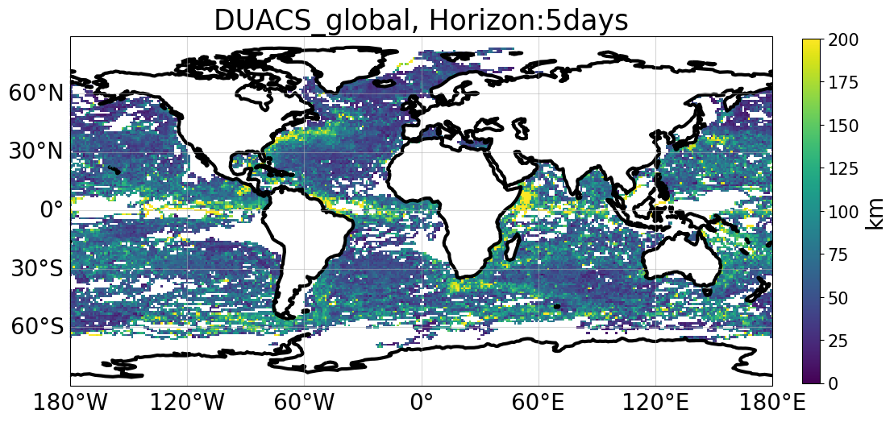

# Currents - Drifter trajectory metrics

 
 

 

## Trajectory deviation
 

[**Check example notebook**](gallery/alongtrack_spectral_description.ipynb)

The drifter trajectory deviation (or Lagrangian Cumulative Distance ; Liu and Weisberg, 2011) is a Lagrangian diagnostic that compares simulated drifters' trajectories with real drifter trajectories that started at the same locations. More precisely, we compute the distances between each drifter's location and the expected locations obtained by advecting past positions by the mapped velocities (with daily forecast lead times ranging from 0 to 5 days).

### &#x2022;  Trajectory deviation maps

 

 

### &#x2022;  Trajectory deviation horizons 

 
 
 
 
 
## References 

- Liu, Y., & Weisberg, R. H. (2011). Evaluation of trajectory modeling in different dynamic regions using normalized cumulative Lagrangian separation. Journal of Geophysical Research: Oceans, 116(C9).
 